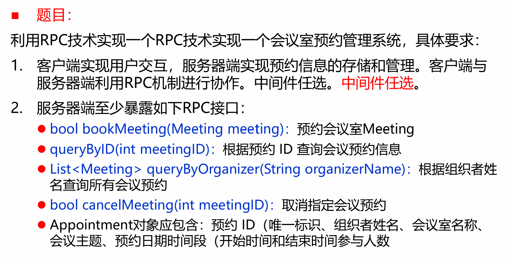
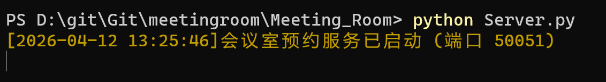
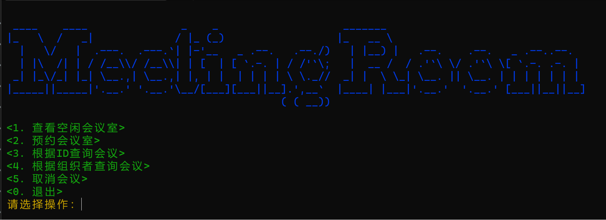
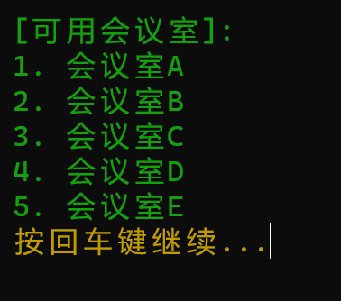
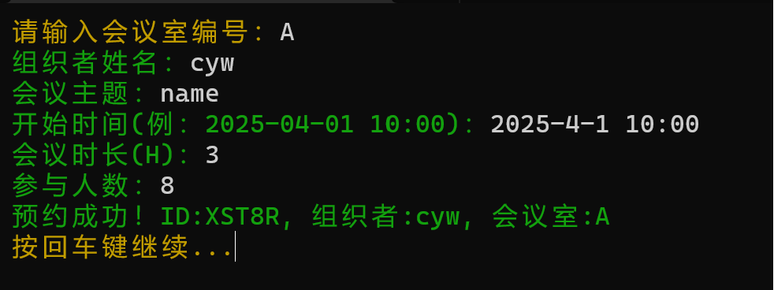
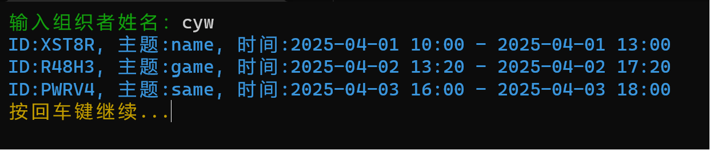
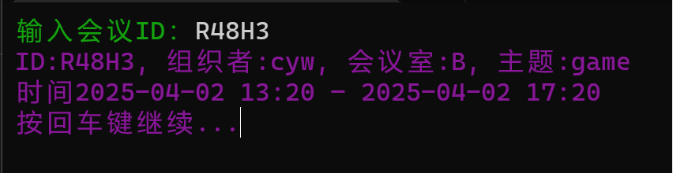
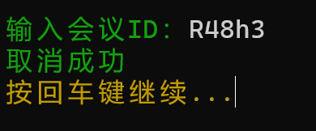
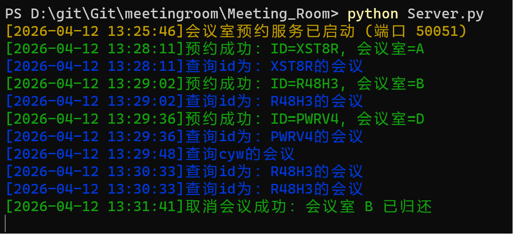

# Meeting_Room
旨在学习gRPC的使用，课程作业

提交作业的主分支，满足基本要求

项目名称：
    基于gRPC的简单项目
运行前提：
    本地计算机安装了python
项目示例：
    在项目文件夹打开两个控制台
    一个启动服务端程序 命令：python Server.py
    一个启动客户端程序 命令：python Client.py

 
 
 
 
 
 
